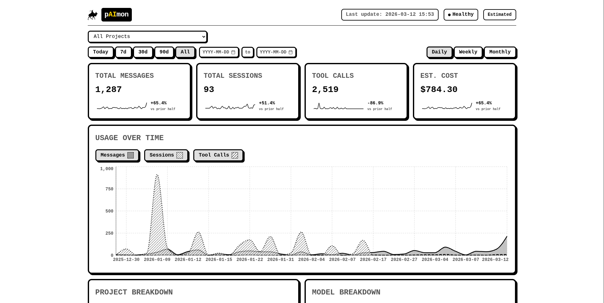

# pAImon

A self-updating dashboard for monitoring your Claude Code usage, costs, and session history.



pAImon reads your local Claude Code data files (`~/.claude/`), ingests them into a SQLite database, and serves a black-and-white dithered dashboard that updates every 5 minutes.

## Why Use pAImon

Claude Code Max and Pro plans charge a flat monthly fee, but that doesn't mean usage is unlimited -- heavy sessions burn through tokens fast, and throttling kicks in when you hit the ceiling. pAImon helps you understand what you're actually getting for your money:

- **See when you work** - Activity heatmaps and calendars show your usage patterns by hour and day, so you can spot peak hours, maintain streaks, and spread usage to avoid throttling.
- **See what you work on most** - Project breakdowns, tool call charts, and project timelines reveal which codebases and tools consume the most tokens, so you can focus your subscription where it matters.
- **See how many tokens you're spending** - Daily cost estimates, model-level usage splits, and budget alerts let you track spend against your monthly plan and catch runaway sessions before they eat your quota.

## What It Reads

pAImon reads from your local Claude Code config directory (default `~/.claude/`):

| File | What It Contains |
|------|-----------------|
| `~/.claude/stats-cache.json` | Aggregated daily activity, model token counts, and session metrics |
| `~/.claude/history.jsonl` | Per-message history with timestamps, projects, and session IDs |
| `~/.claude/projects/*/[sessionId].jsonl` | Full conversation transcripts (user prompts + Claude responses) |
| `~/.claude/projects/*/sessions-index.json` | Session metadata including renamed session names |

Nothing is sent anywhere. All data stays local in a SQLite database at `data/paimon.db`.

## Features

- **Usage charts** - Messages, sessions, and tool calls over time (daily/weekly/monthly)
- **Project breakdown** - Per-project message counts, session counts, and estimated costs
- **Model breakdown** - Cost and usage split across Opus, Sonnet, Haiku with dithered pie chart
- **Tool call breakdown** - Chart and table showing which tools Claude uses most (Read, Bash, Edit, etc.)
- **Activity heatmap** - Hour-of-day x day-of-week grid showing when you use Claude most
- **Activity calendar** - GitHub-style contribution graph with daily intensity, streaks, and active day counts
- **Project timeline** - Multi-project activity grid with daily/weekly/monthly granularity toggle
- **Session names** - Displays renamed session names from `claude session rename` or `/rename`
- **Session browser** - Recent sessions table with copyable session IDs (`claude --resume`)
- **Hide sessions** - Toggle session visibility to declutter the session list
- **Conversation viewer** - Full chat-style modal showing your prompts and Claude's responses
- **Collapsible sections** - Breakdowns and Activity sections collapse to reduce clutter
- **Budget alerts** - Visual warnings when daily or monthly spend exceeds thresholds
- **Cost estimation** - Calculates approximate costs from token counts and model pricing
- **Auto-refresh** - Background collector ingests new data every 5 minutes

## Quick Start

Requires **Node.js 18+**.

```bash
git clone <repo-url> paimon
cd paimon
npm install
npm run build
npm start
```

Open [http://localhost:3000](http://localhost:3000).

For development with hot reload:

```bash
npm run dev
```

This starts both the API server (port 3000) and Vite dev server (port 5173) concurrently.

## Configuration

Copy the example and edit as needed:

```bash
cp .env.example .env
```

| Variable | Default | Description |
|----------|---------|-------------|
| `PORT` | `3000` | Server port |
| `REFRESH_INTERVAL` | `5` | Minutes between data collection cycles |
| `RETENTION_DAYS` | `0` | How many days of data to keep (0 = keep forever) |
| `CLAUDE_HOME` | `~/.claude` | Path to your Claude Code config directory |
| `ANTHROPIC_API_KEY` | _(none)_ | Optional: enables real cost data from the Anthropic API |
| `DAILY_BUDGET_USD` | _(none)_ | Optional: daily spend limit for budget alerts |
| `MONTHLY_BUDGET_USD` | _(none)_ | Optional: monthly spend limit for budget alerts |
| `DITHERED_BACKGROUND` | `true` | Set to `false` for a plain white background |

All settings have sensible defaults. pAImon works out of the box if `~/.claude` exists.

## How It Works

1. **Collector** runs on startup and every `REFRESH_INTERVAL` minutes
2. Reads `stats-cache.json` for aggregate metrics and `history.jsonl` for detailed message history
3. Groups messages into sessions (by explicit session ID, or by 30-minute gap threshold)
4. Reads session names from `sessions-index.json` and `custom-title` entries in session JSONL files
5. Extracts per-tool-type call counts from session JSONL `tool_use` blocks
6. Builds hourly activity data from message timestamps
7. Calculates estimated costs from model token counts and pricing tiers
8. Upserts everything into SQLite with WAL mode for safe concurrent reads
9. Frontend fetches from the API and renders charts with Recharts

## API Endpoints

| Endpoint | Description |
|----------|-------------|
| `GET /api/health` | Health check |
| `GET /api/stats/daily` | Daily stats (filterable by date range, project, model) |
| `GET /api/stats/weekly` | Weekly aggregation |
| `GET /api/stats/monthly` | Monthly aggregation |
| `GET /api/projects` | All projects with totals |
| `GET /api/projects/:name/stats` | Per-project daily stats |
| `GET /api/sessions` | Paginated session list |
| `GET /api/sessions/:id` | Single session details |
| `PATCH /api/sessions/:id/hidden` | Toggle session visibility |
| `GET /api/sessions/:id/conversation` | Full conversation turns from JSONL |
| `GET /api/activity/tool-breakdown` | Tool call counts by type |
| `GET /api/activity/heatmap` | Hour x day-of-week activity grid |
| `GET /api/activity/calendar` | Daily activity for contribution graph |
| `GET /api/activity/project-timeline` | Per-project activity over time |
| `GET /api/config` | Current configuration |
| `PUT /api/config` | Update configuration |
| `GET /api/config/status` | Collection status and health |
| `GET /api/budget` | Current spend vs. budget thresholds |
| `PUT /api/budget/thresholds` | Set budget limits |

All endpoints return `{ success: boolean, data: ... }`.

## Tech Stack

- **Backend** - Node.js, Express 5, better-sqlite3
- **Frontend** - React 19, Recharts 3, Vite 7
- **Database** - SQLite with WAL journaling
- **Testing** - Vitest, React Testing Library

## Running Tests

```bash
npm test              # run once
npm run test:watch    # watch mode
```

## License

MIT - See [LICENSE](LICENSE) for details.
